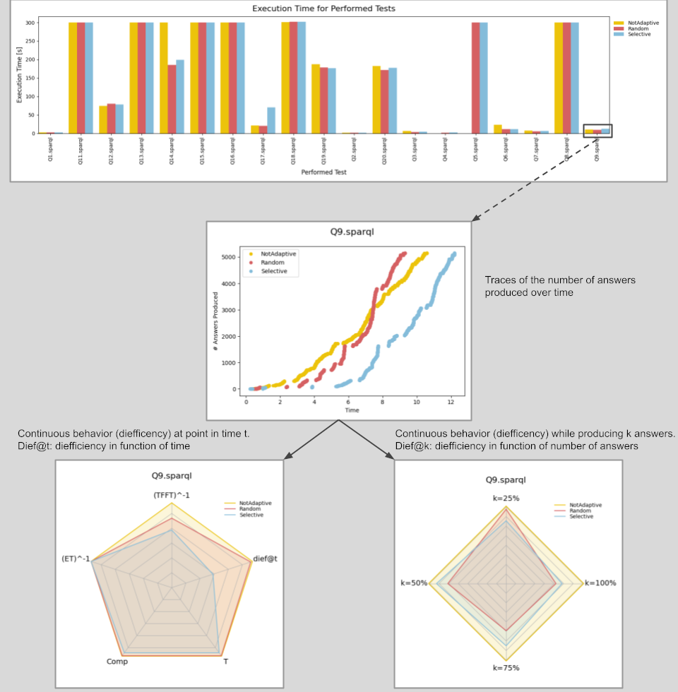

************
Introduction
************

diefpy is a Python package for computing the diefficiency metrics **dief@t** and **dief@k**.

The metrics **dief@t** and **dief@k** allow for measuring the diefficiency during
an elapsed time period *t* or while *k* answers are produced, respectively.
**dief@t** and **dief@k** rely on the computation of the area under the curve (AUC) of
answer traces, and thus capturing the answer rate concentration over a time interval.

This library is a fork of the uncompleted Python 2 project by Maribel Acosta
(`GitHub <https://github.com/maribelacosta/diefpy>`__) and provides a completed Python 3 version.

Description
===========

   Fig. 1: Overview of Result Plots.

Fig. 1 gives an overview of the result plots that can be produced using the package.
Firstly, the overall *Execution Time* for all the tests and approaches (NotAdaptive, Random and Selective) in the metrics
data can be created as a bar plot.
For evaluating the input tests an answer trace of each approach (NotAdaptive, Random and Selective) can be created which shows how many answers were produced.
Finally, two Radar Plots can be created. The Radar Plot on the left compares **dief@t** with other benchmark metrics in a specific test. The other benchmark metrics being conventional metrics like *total execution time*, *time for the first tuple*, *throughput*, and *number of answers produced*.
The Radar Plot on the right compares **dief@k** at different answer completeness percentages in a specific test by measuring the continuous efficiency of approaches when producing
the first 25%, 50%, 75%, and 100% of the answers.

Installation
============

.. NOTE::
   You most likely want to install diefpy into a virtual environment for the experiments you were running.

You can build and install diefpy from source

.. code::

   git clone git@github.com:SDM-TIB/diefpy.git
   cd diefpy
   python -m pip install -e .

or downloading it from PyPI:

.. code::

   python -m pip install diefpy
