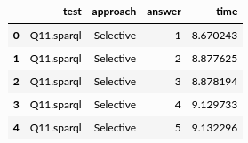
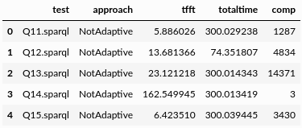

Examples
========

Below are some example use-cases for the diefpy library. They show how to use diefpy.
Before jumping into the examples, the data preparation is explained.

.. rubric:: Data Preparation

To compute the diefficiency metrics **dief@t** and **dief@k**, we need the answer trace produces by the SPARQL query
engines when executing queries.

**Answer traces** record the exact point in time when an engine produces an answer during query execution.

For this tutorial, we executed SPARQL queries using three different configurations of the
`nLDE engine: <http://people.aifb.kit.edu/mac/nlde/>`__ ``Selective``, ``NotAdaptive``, ``Random``.

The resulting answer trace for each query execution is stored in a CSV file available at
`FigShare <https://ndownloader.figshare.com/files/9625852>`__ (137.06 MB). The structure of the CSV file is as follows:

* **test**: id of the query executed. Example: 'Q9.sparql'
* **approach**: name of the approach (or engine) used to execute the query.
* **answer**: the value *i* indicates that this row corresponds to the ith answer produced by *approach* when executing *query*.
* **time**: elapsed time (in seconds) since *approach* started the execution of *query* until the answer *i* is produced.

.. code:: python

   import diefpy

   # Load the answer trace file with the query traces from FigShare.
   traces = diefpy.load_trace("https://ndownloader.figshare.com/files/9625852")

   Fig. 1: Example of Traces Data.

In addition, in this tutorial we are going to compare the performance of the nLDE engine using the metrics
**dief@t** and **dief@k** as well as **conventional metrics** used in the query processing literature, such as:
*execution time*, *time for the first tuple*, and *number of answers produced*.

For this tutorial, we measured the performance of the nLDE engine using conventional metrics.
The results are available at another CSV file in `FigShare <https://ndownloader.figshare.com/files/9660316>`__
(2.86 KB). The structure of this CSV file is as follows:

* **test**: id of the query executed. Example: 'Q9.sparql'
* **approach**: name of the approach (or engine) used to execute the query.
* **tfft**: time (in seconds) required by *approach* to produce the first tuple when executing *query*.
* **totaltime**: elapsed time (in seconds) since *approach* started the execution of *query* until the last answer  of *query* is produced.
* **comp**: number of answers produced by *approach* when executing *query*.

.. code:: python

   # Load the result of the other metrics (execution time, etc.) from FigShare.
   metrics = diefpy.load_metrics("https://ndownloader.figshare.com/files/9660316")

   Fig. 2: Example of Metrics Data.

.. rubric:: Examples
